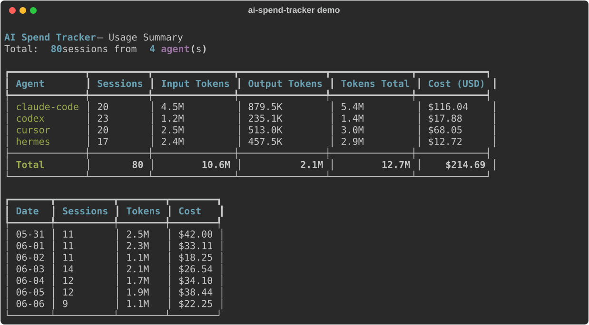

# AI Spend Tracker

**Aggregate token usage & cost across all your AI coding agents in one CLI.**



<p align="center">
  <a href="https://tally.so/r/ODEBZY"><b>📝 Give feedback (1 min)</b></a>
  ·
  <a href="https://github.com/VickPeng/ai-spend-tracker/issues"><b>🐛 Report a bug</b></a>
  ·
  <a href="https://github.com/VickPeng/ai-spend-tracker/discussions"><b>💬 Start a discussion</b></a>
</p>

If you run multiple AI coding tools (Claude Code, Codex, Hermes, OpenClaw, OpenCode, GitHub Copilot, Kimi), you're probably flying blind on how much you're actually spending. AI Spend Tracker reads session data from every agent's local storage and shows you the big picture.

## Features

- **7 built-in collectors** — Hermes Agent, Codex CLI, GitHub Copilot CLI, OpenCode, Claude Code, OpenClaw, Kimi Code CLI
- **Cross-platform** — Windows (native + WSL), Linux, macOS
- **Multi-agent aggregation** — all agents in one report
- **Extensible** — drop a custom collector in `~/.ai-spend/collectors/`
- **Path override** — manual data source path via `~/.ai-spend/config.json`
- **Rich terminal output** — agent summary, model breakdown, daily trends
- **JSON output** — pipe data into your own dashboards

## Supported Agents

| Collector | Agent | Data Source |
|-----------|-------|-------------|
| `hermes` | Hermes Agent (Nous Research) | `~/.hermes/state.db` |
| `codex` | OpenAI Codex CLI | `~/.codex/state_*.sqlite` |
| `copilot` | GitHub Copilot CLI | `~/.copilot/session-store.db` |
| `opencode` | OpenCode CLI | `~/.local/share/opencode/opencode.db` |
| `claude-code` | Claude Code (Anthropic) | `~/.claude/projects/*.jsonl` |
| `openclaw` | OpenClaw | `~/.openclaw/agents/*/sessions/*.jsonl` |
| `kimi` | Kimi Code CLI (Moonshot AI) | `~/.kimi/sessions/*/*/wire.jsonl` |

> Note: Claude Code v2.1.140+ may not persist session logs to disk. See [anthropics/claude-code#25941](https://github.com/anthropics/claude-code/issues/25941).

## Quick Start

```bash
# Install
pip install ai-spend-tracker

# See your usage for the last 7 days
ai-spend

# List available data sources
ai-spend --list-agents

# See only Hermes data
ai-spend --agent hermes

# All historical data (no time limit)
ai-spend --days 0

# JSON output
ai-spend --format json
```

## Usage

```
ai-spend [options]

Options:
  --list-agents         List all available data collectors
  --init [name]         Initialize ~/.ai-spend/ directory
  --agent AGENT         Filter by agent name (comma-separated)
  --days DAYS           Days to look back (default: 7, 0 = all time)
  --since YYYY-MM-DD    Start date
  --until YYYY-MM-DD    End date
  --format {table,json} Output format (default: table)
  --demo                Show sample data (no real agents needed)
```

## Path Override

If auto-detection fails, manually specify data source paths:

```json
// ~/.ai-spend/config.json
{"paths": {
  "hermes": "D:/custom/hermes/state.db",
  "codex": "C:/Users/me/.codex/state_1.sqlite",
  "copilot": "D:/copilot/session-store.db",
  "opencode": "D:/opencode/opencode.db",
  "claude-code": "D:/claude/projects",
  "openclaw": "D:/.openclaw",
  "kimi": "D:/.kimi"
}}
```

## Custom Collectors

Create your own collector in `~/.ai-spend/collectors/`:

```bash
ai-spend init my-agent
# Edit ~/.ai-spend/collectors/my-agent.py
# Implement BaseCollector.name(), display_name(), collect()
```

## Platform Support

| Platform | Status |
|----------|--------|
| Linux | ✅ Full |
| macOS | ✅ Full |
| Windows (native) | ✅ Full |
| Windows (WSL) | ✅ Full |

## License

MIT
